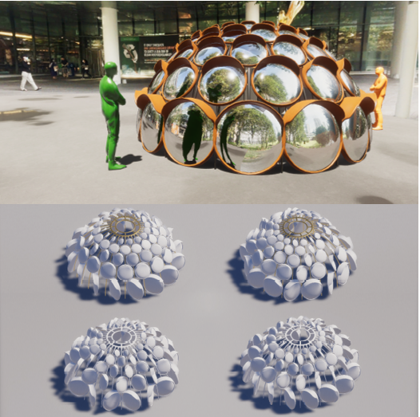

## Art Projects

### 1. 

I have always had a passion for creating a public art installation and I finally realized it by participating NUS Public Art Competition 2021. Given the year’s theme of ‘light’ (especially in response to Covid-19 pandemic), my team designed an Igloo-like interactive installation that consists of rotatory road mirrors. The reflection from road mirrors creates variations of distortion as visitors move along their convex curvature and as they interact with mirrors (by pushing and rotating those mirrors) with their friends. Such reflection encourages visitors to engage in deeper introspection of themselves. their place in society and how they might be able to translate these thoughts into meaningful actions for the community. Just like road mirrors on street ensure the safety of drivers and pedestrians and igloos in Poles provide a shield against harsh weather, we hope our artwork to provide a beacon of care and hope in our toughest times through the pandemic. The artwork was to be installed in NUS Utown, where many NUS students gather every day to chill, study, and work but was not realized unfortunately due to conflicts in the manufacturing schedule.

[back](./)
