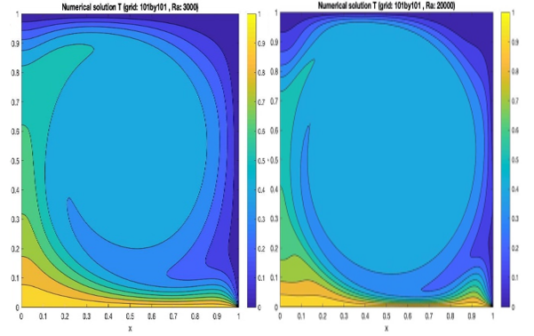

## Computational Modeling and Simulation Projects

### 1.

For ME5302 Computational Fluid Dynamics at NUS, I implemented a natural convection simulation of a two-dimensional square cavity in MATLAB from scratch. The stream function-vorticity formulation of the Navier-Stokes equation was used. I used the second-order finite difference scheme to numerically discretize the equations in space the Euler explicit scheme to discretize the equations in time. Finally, I implemented the Jacobi-relaxation solver to march in time. The program accepts various mesh sizes, Prandtl number, Rayleigh number, and boundary conditions. The figure compares the result with two different Rayleigh numbers, where a more turbulent flow with secondary eddies is observed with a higher Rayleigh number (right figure).

### 2. 

For ME4291 Finite Element Analysis at NUS, I implemented a finite element solver for material non-linearity in MATLAB. A thin uniform plate subject to a point load (ie point stress) is investigated. The plate is modelled with uniform beam elements according to the Euler-Bernoulli beam theorem and it is assumed to be isotropic. The material nonlinearity is modelled by the strain hardening exponent and the exponent is found numerically by fixed-point iteration. The program accepts various mesh sizes and boundary conditions and solves for displacement, reaction force, and strain over the plate.

[back](./)

