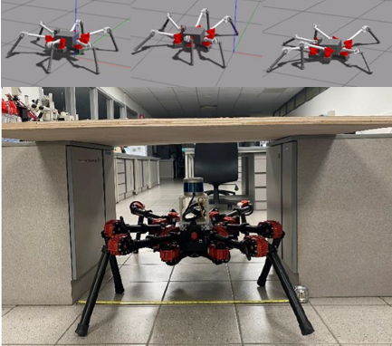
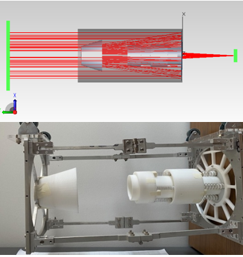

## Mechatronics Projects

### 1. Bio-inspired control for navigating confined spaces in disaster recovery (Thesis)

After reading CS432 during my exchange at EPFL, I was captivated by the idea of Central Pattern Generators (biological neural circuits located in the spinal cord that can generate rhythmic motor patterns in the absence of sensory or descending inputs from the brain, abbreviated as CPGs) and its application in robot controls. Back in NUS, I found that a lab named MultiAgent Robotic MOTion laboratory (MARMoT lab) is working on bio-inspired control of hexapod robots using CPGs. I found that despite the high degrees of freedom that a hexapod has there has been little work done to optimize its pose (positions and orientations of robot body and legs) or gait types (such as tripod, tetrapod, wave gaits) that would be required to navigate through confined spaces. Thus, I self-proposed this project for my undergraduate thesis to further investigate it under the supervision of Professor Guillaume, the director of MARMoT lab.\
My work uses the Kuramoto-Hopf oscillator to model CPGs and generates hexapod gaits (ie both poses and gait types). Then, given the dimension of a specific confined space, it runs stochastic mini-batch gradient descent optimization to find the best gait in terms of stability, kinematic constraints, and joint constraints of a hexapod. The optimization algorithm is tested using ROS Gazebo simulation and using real robots from HEBI robotics with 3D LidDAR. Despite the highly complicated non-convex workspace of a hexapod and conflicting cost functions of the optimization, it successfully optimizes CPG parameters and finds the optimal gaits.\
To the best of my knowledge, this research provides a systematic way of optimizing hexapod gaits for a given confined space for the first time. The key success factors are as the following: Firstly, using the Kuramoto-Hopf oscillator as a building block of the optimization greatly reduces the dimension of the optimization space and simplifies the problem by guaranteeing the convergence to specific gaits regardless of the initial conditions. Secondly, the penalization terms that are originally devised to define the total cost function provides extra exploratory power to escape bad local optima in the non-convex and many local optima workspace.

### 2. Design of a deployable light baffle for a deployable Cassegrain telescope in CubeSat

During this time, I was in origami and deployable structures like James Webb Space Telescope. To further study the potential of these structures, I self-proposed the project for EG3301R at NUS iDP. (An engineering design course where students practice and apply design thinking framework to solve their own choices of real-world problems. Students usually select their projects from a given project list.)
CubeSats are increasingly using Cassegrain telescopes to achieve high-resolution Earth observation. However, Cassegrain telescopes are especially vulnerable to stray lights and they need a properly designed light baffle to improve image qualities. The biggest challenges of designing such light baffle are 1. achieving high packing efficiency and 2. assuring the position accuracy (to not obstruct useful lights for the telescope and to attenuate stray lights at the same time) when deployed, and 3. making it lightweight.\
This project proposes an innovative design that solves such problems by stacking individual baffle cups in a zigzagged way and using a spring deployment mechanism. The zigzagged stacking was a game-changer, as it 1. minimizes the baffle area wasted for the deployment and 2. smartly hides pin holders for alignment and locking of baffles cups without additional light obstruction. In results, the final baffle system can deploy from 60mm to 148.7mm and weighs 0.3kg (top left: stowed configuration, bottom left: deployed configuration, bottom right: the baffle model integrated with the Cassegrain telescope). The optical requirement was verified by running the optical simulator TracePro (top right). Space environment survival requirements are tested by running static analysis under micro-gravitational load in SolidWorks. The deployment and locking mechanism were verified using 3D printed model. The project also distributes a MATLAB program that iteratively solves optics equations and outputs optimal baffle dimensions so that the design can be easily adopted by any CubeSat Cassegrain telescope. For future work, optimizing the design for manufacturing and integration is needed.

[back](./)
